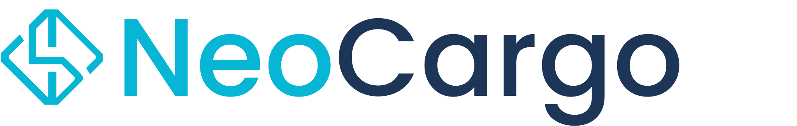

# 🚚 NeoCargo Documentation

<div align="center">
  
  <br>
  <h3>Sistema inteligente de simulação e alocação de veículos para transporte de cargas</h3>
  
  [](https://Transportadora-Django.github.io/Documentacao/)
  [](https://github.com/Transportadora-Django/Documentacao/actions/workflows/deploy-docs.yml)
  [](LICENSE)
</div>

---

## 📘 Sobre o Projeto

Este projeto integra a disciplina **Técnicas de Programação para Plataformas Emergentes (FGA0242)** e tem como objetivo demonstrar todas as etapas de um desenvolvimento de software **de ponta a ponta**: levantamento e análise, modelagem, implementação, testes e documentação.

## 🔎 Ponto de Partida

O projeto **não** parte apenas do enunciado: ele utiliza e **reaproveita implementações existentes** do repositório base, reorganizando-as no padrão Django (MVT) e **ampliando a regra de negócio** com novos perfis (Gerente, Motorista, Cliente).

👉 **Repositório base:** [OOP_ep2_mirror](https://github.com/wagnermc506/OOP_ep2_mirror/tree/master)

## 🎯 Objetivo do Sistema

Construir um sistema de simulação e alocação de veículos para fretes que:

- 📊 **Entrada de Dados** - Receba peso, distância e prazo de entrega
- 💰 **Cálculo Inteligente** - Calcule tempo e custo por tipo de veículo (com margem de lucro e preço de combustível)
- 🏆 **Três Recomendações** - Exiba opções: menor custo, mais rápido e melhor custo-benefício
- 🔒 **Controle de Disponibilidade** - Bloqueie o veículo selecionado até a liberação
- 💾 **Persistência de Dados** - Persista frota, preços e margem de lucro

## ⚙️ Tecnologias

| Categoria | Tecnologia | Descrição |
|-----------|------------|-----------|
| **Backend** | Django (MVT) | Framework web Python |
| **Frontend** | HTML/CSS/JS | Templates do Django |
| **Infra** | Docker | Containerização |
| **Docs** | MkDocs | Documentação técnica |

## 📚 Documentação

A documentação completa está disponível em: **[https://Transportadora-Django.github.io/Documentacao/](https://Transportadora-Django.github.io/Documentacao/)**

### Estrutura da Documentação

- 🏠 **[Home](https://Transportadora-Django.github.io/Documentacao/)** - Visão geral do projeto
- 💡 **[Brainstorm](https://Transportadora-Django.github.io/Documentacao/04-brainstorm-historias/)** - 16 histórias de usuário organizadas por perfil
- 📑 **[Backlog](https://Transportadora-Django.github.io/Documentacao/05-backlog/)** - Histórias priorizadas com critérios de aceite

## 🚀 Como Executar a Documentação

### Pré-requisitos

- Python 3.8+
- pip

### Instalação

1. Clone o repositório:
```bash
git clone https://github.com/Transportadora-Django/Documentacao.git
cd Documentacao
```

2. Instale as dependências:
```bash
pip install -r requirements.txt
```

3. Execute o servidor de desenvolvimento:
```bash
mkdocs serve
```

4. Acesse no navegador:
```
http://127.0.0.1:8000/TPPE-2025.2/
```

### Build para Produção

```bash
mkdocs build
```

Os arquivos estáticos serão gerados na pasta `site/`.

## 📊 Resumo do Backlog

| Prioridade | Cliente | Gerente | Motorista | Sistema | Total |
|------------|---------|---------|-----------|---------|-------|
| **P1** | 2 | 3 | 0 | 4 | **9** |
| **P2** | 1 | 2 | 2 | 0 | **5** |
| **P3** | 1 | 1 | 0 | 0 | **2** |
| **Total** | **4** | **6** | **2** | **4** | **16** |

## 🔧 Deploy Automático

O projeto está configurado com **GitHub Actions** para deploy automático no **GitHub Pages**. A cada push na branch `main`, a documentação é automaticamente construída e publicada.

## 👥 Perfis de Usuário

- **👤 Cliente** - Solicita orçamentos e acompanha pedidos
- **👤 Gerente** - Configura frota, margem de lucro, preços e aprova pedidos  
- **👤 Motorista** - Aceita fretes e atualiza status da viagem
- **⚙️ Sistema** - Regras de negócio e validações automáticas

## 📄 Licença

Este projeto está sob a licença MIT. Veja o arquivo [LICENSE](LICENSE) para mais detalhes.

---

<div align="center">
  <strong>✨ NeoCargo - Bringing a new era of smart logistics</strong>
</div>