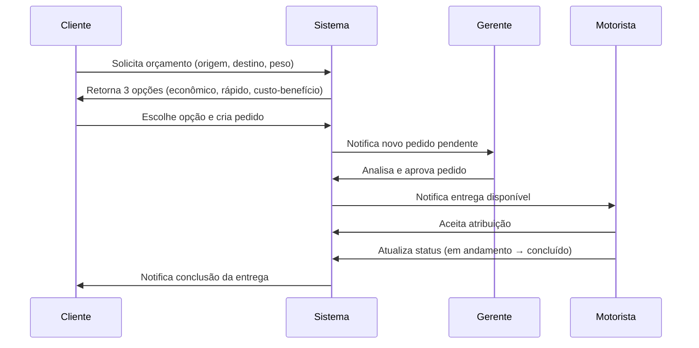

# Diagramas UML do Sistema NeoCargo

Este documento apresenta os **diagramas de classes UML** do sistema NeoCargo, incluindo a arquitetura planejada e a implementação real do código.

---

## Sobre o Projeto

O **NeoCargo** é uma plataforma web de transporte modular desenvolvida em **Django (MVT)** que simula o funcionamento completo de uma transportadora moderna. O sistema gerencia todo o ciclo de vida de pedidos de frete, desde a cotação inicial até a entrega final, com controle de permissões e múltiplos perfis de usuário.

### Principais Funcionalidades

- **Clientes**: Solicitam orçamentos personalizados e criam pedidos de transporte
- **Gerentes**: Analisam, aprovam/rejeitam pedidos e gerenciam a operação
- **Motoristas**: Aceitam entregas, atualizam status em tempo real e informam localização
- **Owner (Dono)**: Administra permissões, configurações globais e governança do sistema
- **Sistema**: Notificações automáticas, histórico completo de mudanças e rastreamento de status

### Stack Tecnológica

- **Backend**: Django 4.x (Python)
- **Frontend**: Templates Django + HTML/CSS/JavaScript
- **Banco de Dados**: PostgreSQL
- **Infraestrutura**: Docker + Docker Compose
- **Documentação**: MkDocs Material

---

## Diagrama de Classes Planejado

Este diagrama representa a **arquitetura completa planejada** do sistema, incluindo todas as funcionalidades previstas no backlog, tanto as já implementadas quanto as que serão desenvolvidas nas próximas sprints.

!!! tip "Dica de Visualização"
    Para melhor visualização do diagrama:
    
    - **Zoom**: Use `Ctrl + Scroll` (Windows/Linux) ou `Cmd + Scroll` (Mac) para dar zoom
    - **Tela Cheia**: Clique com o botão direito no diagrama e selecione "Abrir imagem em nova aba"
    - **Download**: Você pode exportar o diagrama usando ferramentas como [Mermaid Live Editor](https://mermaid.live/)
    
    **Recomendação**: Para diagramas grandes, recomendamos abrir em tela cheia ou usar zoom de 150-200%

```mermaid
classDiagram
    %% ============================================
    %% NÚCLEO DE USUÁRIOS E AUTENTICAÇÃO
    %% ============================================
    
    class User {
        +int id
        +str username
        +str email
        +str password
        +str first_name
        +str last_name
        +bool is_active
        +bool is_staff
        +datetime date_joined
    }
    
    class Profile {
        +int id
        +str role
        +datetime created_at
        +datetime updated_at
        +bool is_cliente()
        +bool is_motorista()
        +bool is_gerente()
        +bool is_owner()
    }
    
    class Role {
        <<enumeration>>
        CLIENTE
        MOTORISTA
        GERENTE
        OWNER
    }
    
    class EmailChangeRequest {
        +int id
        +str old_email
        +str new_email
        +UUID token
        +datetime created_at
        +datetime expires_at
        +bool confirmed
        +datetime confirmed_at
        +bool is_expired()
        +bool is_valid()
    }
    
    %% ============================================
    %% PEDIDOS E CICLO DE VIDA
    %% ============================================
    
    class Pedido {
        +int id
        +str cidade_origem
        +str cidade_destino
        +decimal peso_carga
        +int prazo_desejado
        +str observacoes
        +str opcao
        +decimal preco_final
        +str prazo_final
        +str veiculo_final
        +str status
        +int numero_pedido_cliente
        +datetime created_at
        +datetime updated_at
        +bool is_cotacao()
        +bool is_pendente()
        +bool is_cancelado()
        +bool pode_ser_cancelado()
        +bool cancelar()
    }
    
    class StatusPedido {
        <<enumeration>>
        COTACAO
        PENDENTE
        APROVADO
        RECUSADO
        CANCELADO
        EM_TRANSPORTE
        CONCLUIDO
    }
    
    class OpcaoCotacao {
        <<enumeration>>
        ECONOMICO
        RAPIDO
        CUSTO_BENEFICIO
    }
    
    class Orcamento {
        +int id
        +str tipo_opcao
        +decimal preco
        +int prazo_dias
        +str tipo_veiculo
        +str justificativa
        +datetime created_at
        +bool is_economico()
        +bool is_rapido()
        +bool is_custo_beneficio()
    }
    
    class PedidoHistorico {
        +int id
        +str status_anterior
        +str status_novo
        +str observacoes
        +datetime created_at
    }
    
    class Notificacao {
        +int id
        +str tipo
        +str titulo
        +str mensagem
        +bool lida
        +datetime created_at
        +datetime lida_em
    }
    
    %% ============================================
    %% VEÍCULOS E ESPECIFICAÇÕES
    %% ============================================
    
    class EspecificacaoVeiculo {
        +int id
        +str tipo
        +str combustivel_principal
        +str combustivel_alternativo
        +float rendimento_principal
        +float rendimento_alternativo
        +float carga_maxima
        +int velocidade_media
        +float reducao_rendimento_principal
        +float reducao_rendimento_alternativo
        +datetime created_at
        +datetime updated_at
    }
    
    class Veiculo {
        +int id
        +str marca
        +str modelo
        +str placa
        +int ano
        +str cor
        +bool ativo
        +datetime created_at
        +datetime updated_at
    }
    
    class TipoVeiculo {
        <<enumeration>>
        CARRETA
        VAN
        CARRO
        MOTO
    }
    
    class TipoCombustivel {
        <<enumeration>>
        DIESEL
        GASOLINA
        ALCOOL
    }
    
    %% ============================================
    %% OPERAÇÕES - MOTORISTAS E SEDES
    %% ============================================
    
    class Motorista {
        +int id
        +str telefone
        +str cpf
        +str endereco
        +date data_nascimento
        +bool disponivel
        +datetime created_at
        +datetime updated_at
    }
    
    class Sede {
        +int id
        +str nome
        +str cidade
        +str estado
        +str endereco
        +str telefone
        +bool ativa
        +datetime created_at
        +datetime updated_at
    }
    
    class AtribuicaoPedido {
        +int id
        +datetime atribuido_em
        +datetime aceito_em
        +datetime iniciado_em
        +datetime concluido_em
        +str status
        +str observacoes
        +datetime created_at
        +datetime updated_at
    }
    
    class StatusAtribuicao {
        <<enumeration>>
        ATRIBUIDO
        ACEITO
        EM_ANDAMENTO
        CONCLUIDO
        CANCELADO
    }
    
    %% ============================================
    %% GOVERNANÇA E PERMISSÕES
    %% ============================================
    
    class SolicitacaoMudancaPerfil {
        +int id
        +str role_atual
        +str role_solicitada
        +str justificativa
        +str telefone
        +str cpf
        +str endereco
        +date data_nascimento
        +str tipo_veiculo
        +str modelo_veiculo
        +str placa_veiculo
        +int ano_veiculo
        +str cor_veiculo
        +str status
        +str observacoes_admin
        +datetime data_aprovacao
        +datetime created_at
        +datetime updated_at
        +bool is_pendente()
        +bool is_aprovada()
        +bool is_rejeitada()
    }
    
    class StatusSolicitacao {
        <<enumeration>>
        PENDENTE
        APROVADA
        REJEITADA
    }
    
    class Permissao {
        +int id
        +str nome
        +str descricao
        +str escopo
        +bool pode_gerenciar_pedidos
        +bool pode_gerenciar_motoristas
        +bool pode_gerenciar_veiculos
        +bool pode_gerenciar_usuarios
        +datetime created_at
        +datetime updated_at
    }
    
    class ConfiguracaoSistema {
        +int id
        +bool solicitacoes_abertas
        +str mensagem_solicitacoes_fechadas
        +datetime atualizado_em
        +ConfiguracaoSistema get_config()
    }
    
    class PrecosCombustivel {
        +int id
        +decimal preco_diesel
        +decimal preco_gasolina
        +decimal preco_alcool
        +decimal margem_lucro
        +datetime vigencia_inicio
        +datetime vigencia_fim
        +bool ativo
        +datetime created_at
        +datetime updated_at
    }
    
    %% ============================================
    %% RELACIONAMENTOS
    %% ============================================
    
    %% Usuários e Perfis
    User "1" -- "1" Profile : possui
    Profile -- Role : usa
    User "1" -- "0..*" EmailChangeRequest : solicita
    
    %% Pedidos
    User "1" -- "0..*" Pedido : cria
    Pedido -- StatusPedido : possui
    Pedido -- OpcaoCotacao : escolhe
    Pedido "1" -- "0..*" Orcamento : gera
    Pedido "1" -- "0..*" PedidoHistorico : registra
    User "1" -- "0..*" PedidoHistorico : modifica
    
    %% Notificações
    User "1" -- "0..*" Notificacao : recebe
    Notificacao "0..1" -- "0..1" Pedido : referencia
    
    %% Veículos
    EspecificacaoVeiculo -- TipoVeiculo : define
    EspecificacaoVeiculo -- TipoCombustivel : usa
    EspecificacaoVeiculo "1" -- "0..*" Veiculo : especifica
    Veiculo "0..1" -- "0..*" AtribuicaoPedido : utilizado_em
    
    %% Motoristas e Operações
    User "1" -- "0..1" Motorista : é
    Motorista "1" -- "0..1" Veiculo : dirige
    Motorista "1" -- "1" Sede : trabalha_em
    Motorista "1" -- "0..*" AtribuicaoPedido : recebe
    Pedido "1" -- "0..*" AtribuicaoPedido : atribuido_a
    AtribuicaoPedido -- StatusAtribuicao : possui
    
    %% Governança
    User "1" -- "0..*" SolicitacaoMudancaPerfil : solicita
    SolicitacaoMudancaPerfil -- StatusSolicitacao : possui
    User "0..1" -- "0..*" SolicitacaoMudancaPerfil : aprova
    User "1" -- "0..*" Permissao : possui
    User "0..1" -- "0..*" ConfiguracaoSistema : atualiza
    
    %% Configurações
    Orcamento -- PrecosCombustivel : calcula_com
```

---

## Descrição dos Módulos

### Núcleo de Usuários
- **User**: Usuário base do Django com autenticação
- **Profile**: Extensão do usuário com role (cliente, motorista, gerente, owner)
- **EmailChangeRequest**: Solicitações de mudança de email com confirmação por token

### Gestão de Pedidos
- **Pedido**: Solicitação de frete com origem, destino, peso e prazo
- **Orcamento**: Opções de cotação (econômico, rápido, custo-benefício)
- **PedidoHistorico**: Rastreamento de mudanças de status
- **Notificacao**: Alertas automáticos para usuários

### Veículos e Frota
- **EspecificacaoVeiculo**: Características técnicas por tipo (carreta, van, carro, moto)
- **Veiculo**: Instâncias reais da frota com placa, modelo, ano
- **PrecosCombustivel**: Tabela de preços e margem de lucro

### Operações e Logística
- **Motorista**: Dados do motorista vinculado a um usuário
- **Sede**: Locais de operação da transportadora
- **AtribuicaoPedido**: Atribuição de entregas aos motoristas

### Governança e Controle
- **SolicitacaoMudancaPerfil**: Pedidos de mudança de cliente → motorista/gerente
- **Permissao**: Controle granular de acesso para gerentes
- **ConfiguracaoSistema**: Configurações globais do sistema

---

## Fluxo Principal do Sistema

---

## Observações Técnicas

### Heranças e Extensões
- `Profile` estende `User` via OneToOne (padrão Django)
- `Motorista` também estende `User` para dados específicos
- Enumerações (`Role`, `StatusPedido`, etc.) usam `TextChoices` do Django

### Relacionamentos Principais
- **1:N** - Um cliente cria muitos pedidos
- **1:N** - Um pedido gera múltiplos orçamentos
- **1:N** - Um motorista recebe várias atribuições
- **N:M** - Usuários podem ter múltiplas permissões

### Campos Calculados
- Orçamentos calculam preço baseado em:
  - Distância entre cidades
  - Peso da carga
  - Tipo de veículo
  - Preço do combustível
  - Margem de lucro

---

## Diagrama de Classes Executado

Este diagrama será gerado **automaticamente a partir do código real** do sistema, refletindo a implementação atual das classes, métodos e relacionamentos.

!!! info "Em Desenvolvimento"
    O diagrama de classes executado estará disponível em breve. Ele será gerado através de engenharia reversa do código Django, utilizando ferramentas como:
    
    - **django-extensions** com `graph_models`
    - **pyreverse** (parte do pylint)
    - **PlantUML** para renderização
    
    Este diagrama mostrará:
    
    - Classes realmente implementadas no código
    - Métodos e atributos concretos
    - Relacionamentos efetivos (ForeignKey, OneToOne, ManyToMany)
    - Herança de classes Django (models.Model, User, etc.)
    - Validadores e constraints do banco de dados
    
    **Status**: Aguardando conclusão da Sprint 1

---

## Comparação: Planejado vs Executado

| Aspecto | Diagrama Planejado | Diagrama Executado |
|---------|-------------------|-------------------|
| **Fonte** | Backlog e histórias de usuário | Código-fonte real (models.py) |
| **Objetivo** | Visão completa do sistema | Estado atual da implementação |
| **Atualização** | Manual, conforme planejamento | Automática via ferramentas |
| **Detalhamento** | Conceitual e de alto nível | Técnico e detalhado |
| **Funcionalidades** | Todas (implementadas + futuras) | Apenas implementadas |

---

## Documentação Relacionada

Para entender melhor a evolução e o planejamento do sistema, consulte:

- [Brainstorm de Histórias](04-brainstorm-historias.md) - Ideação inicial das funcionalidades
- [Backlog Priorizado](05-backlog.md) - Histórias de usuário detalhadas com critérios de aceite
- [Home](index.md) - Visão geral do projeto e tecnologias

---

## Dicas de Uso

### Para Desenvolvedores
- Use o **diagrama planejado** para entender a arquitetura completa e as integrações futuras
- Consulte o **diagrama executado** (quando disponível) para ver a implementação real e debugar

### Para Stakeholders
- O **diagrama planejado** mostra o escopo completo do projeto
- O **diagrama executado** demonstra o progresso real da implementação

### Para Novos Membros da Equipe
- Comece pelo **diagrama planejado** para ter a visão geral
- Use o **fluxo de sequência** para entender as interações entre componentes
- Consulte o código-fonte junto com o **diagrama executado** para onboarding técnico
