# Banco de Dados do Sistema NeoCargo

Este documento apresenta a **modelagem do banco de dados** do sistema NeoCargo, incluindo o modelo relacional planejado e a estrutura real implementada.

---

## Sobre a Modelagem

O banco de dados do **NeoCargo** foi projetado para suportar todas as operações de uma transportadora moderna, desde o cadastro de usuários até o rastreamento completo de entregas. A modelagem segue os princípios de normalização e utiliza o ORM do Django para abstração das operações.

### Características Principais

- **SGBD**: PostgreSQL 14+
- **ORM**: Django ORM
- **Normalização**: 3ª Forma Normal (3FN)
- **Integridade Referencial**: Garantida via Foreign Keys e constraints
- **Auditoria**: Campos `created_at` e `updated_at` em todas as tabelas principais
- **Soft Delete**: Campos `ativo` para desativação lógica quando aplicável

### Tecnologias Utilizadas

- **PostgreSQL**: Banco de dados relacional robusto e escalável
- **Django Migrations**: Controle de versionamento do schema
- **pgAdmin**: Ferramenta de administração (desenvolvimento)
- **Docker**: Containerização do banco para ambientes consistentes

---

## Diagrama Entidade-Relacionamento Planejado

Este diagrama representa o **modelo de dados completo planejado**, incluindo todas as tabelas e relacionamentos previstos no projeto.

!!! tip "Dica de Visualização"
    Para melhor visualização do diagrama:
    
    - **Zoom**: Use `Ctrl + Scroll` (Windows/Linux) ou `Cmd + Scroll` (Mac) para dar zoom
    - **Tela Cheia**: Clique com o botão direito no diagrama e selecione "Abrir imagem em nova aba"
    - **Download**: Você pode exportar o diagrama usando ferramentas como [Mermaid Live Editor](https://mermaid.live/)
    
    **Recomendação**: Para diagramas grandes, recomendamos abrir em tela cheia ou usar zoom de 150-200%

```mermaid
erDiagram
    %% ============================================
    %% AUTENTICAÇÃO E USUÁRIOS
    %% ============================================
    
    auth_user {
        int id PK
        string username UK
        string email UK
        string password
        string first_name
        string last_name
        boolean is_active
        boolean is_staff
        boolean is_superuser
        datetime date_joined
        datetime last_login
    }
    
    contas_profile {
        int id PK
        int user_id FK,UK
        string role
        datetime created_at
        datetime updated_at
    }
    
    contas_emailchangerequest {
        int id PK
        int user_id FK
        string old_email
        string new_email
        uuid token UK
        datetime created_at
        datetime expires_at
        boolean confirmed
        datetime confirmed_at
    }
    
    %% ============================================
    %% PEDIDOS E COTAÇÕES
    %% ============================================
    
    pedidos_pedido {
        int id PK
        int cliente_id FK
        string cidade_origem
        string cidade_destino
        decimal peso_carga
        int prazo_desejado
        text observacoes
        string opcao
        decimal preco_final
        string prazo_final
        string veiculo_final
        string status
        int numero_pedido_cliente
        datetime created_at
        datetime updated_at
    }
    
    pedidos_orcamento {
        int id PK
        int pedido_id FK
        string tipo_opcao
        decimal preco
        int prazo_dias
        string tipo_veiculo
        text justificativa
        datetime created_at
    }
    
    pedidos_pedidohistorico {
        int id PK
        int pedido_id FK
        int modificado_por_id FK
        string status_anterior
        string status_novo
        text observacoes
        datetime created_at
    }
    
    pedidos_notificacao {
        int id PK
        int usuario_id FK
        int pedido_id FK
        string tipo
        string titulo
        text mensagem
        boolean lida
        datetime created_at
        datetime lida_em
    }
    
    %% ============================================
    %% VEÍCULOS E ESPECIFICAÇÕES
    %% ============================================
    
    veiculos_especificacaoveiculo {
        int id PK
        string tipo UK
        string combustivel_principal
        string combustivel_alternativo
        float rendimento_principal
        float rendimento_alternativo
        float carga_maxima
        int velocidade_media
        float reducao_rendimento_principal
        float reducao_rendimento_alternativo
        datetime created_at
        datetime updated_at
    }
    
    veiculos_veiculo {
        int id PK
        int especificacao_id FK
        string marca
        string modelo
        string placa UK
        int ano
        string cor
        boolean ativo
        datetime created_at
        datetime updated_at
    }
    
    veiculos_precoscombustivel {
        int id PK
        decimal preco_diesel
        decimal preco_gasolina
        decimal preco_alcool
        decimal margem_lucro
        datetime vigencia_inicio
        datetime vigencia_fim
        boolean ativo
        datetime created_at
        datetime updated_at
    }
    
    %% ============================================
    %% OPERAÇÕES E LOGÍSTICA
    %% ============================================
    
    operacoes_motorista {
        int id PK
        int user_id FK,UK
        int veiculo_id FK
        int sede_id FK
        string telefone
        string cpf UK
        string endereco
        date data_nascimento
        boolean disponivel
        datetime created_at
        datetime updated_at
    }
    
    operacoes_sede {
        int id PK
        string nome
        string cidade
        string estado
        string endereco
        string telefone
        boolean ativa
        datetime created_at
        datetime updated_at
    }
    
    operacoes_atribuicaopedido {
        int id PK
        int pedido_id FK
        int motorista_id FK
        int veiculo_id FK
        datetime atribuido_em
        datetime aceito_em
        datetime iniciado_em
        datetime concluido_em
        string status
        text observacoes
        datetime created_at
        datetime updated_at
    }
    
    %% ============================================
    %% GOVERNANÇA E PERMISSÕES
    %% ============================================
    
    gestao_solicitacaomudancaperfil {
        int id PK
        int usuario_id FK
        int aprovado_por_id FK
        string role_atual
        string role_solicitada
        text justificativa
        string telefone
        string cpf
        string endereco
        date data_nascimento
        string tipo_veiculo
        string modelo_veiculo
        string placa_veiculo
        int ano_veiculo
        string cor_veiculo
        string status
        text observacoes_admin
        datetime data_aprovacao
        datetime created_at
        datetime updated_at
    }
    
    gestao_permissao {
        int id PK
        int user_id FK
        string nome
        text descricao
        string escopo
        boolean pode_gerenciar_pedidos
        boolean pode_gerenciar_motoristas
        boolean pode_gerenciar_veiculos
        boolean pode_gerenciar_usuarios
        datetime created_at
        datetime updated_at
    }
    
    gestao_configuracaosistema {
        int id PK
        int atualizado_por_id FK
        boolean solicitacoes_abertas
        text mensagem_solicitacoes_fechadas
        datetime atualizado_em
    }
    
    %% ============================================
    %% RELACIONAMENTOS
    %% ============================================
    
    %% Usuários e Perfis
    auth_user ||--|| contas_profile : "possui"
    auth_user ||--o{ contas_emailchangerequest : "solicita"
    
    %% Pedidos
    auth_user ||--o{ pedidos_pedido : "cria"
    pedidos_pedido ||--o{ pedidos_orcamento : "gera"
    pedidos_pedido ||--o{ pedidos_pedidohistorico : "registra"
    auth_user ||--o{ pedidos_pedidohistorico : "modifica"
    auth_user ||--o{ pedidos_notificacao : "recebe"
    pedidos_pedido ||--o{ pedidos_notificacao : "referencia"
    
    %% Veículos
    veiculos_especificacaoveiculo ||--o{ veiculos_veiculo : "especifica"
    
    %% Operações
    auth_user ||--o| operacoes_motorista : "é"
    veiculos_veiculo ||--o| operacoes_motorista : "dirige"
    operacoes_sede ||--o{ operacoes_motorista : "trabalha_em"
    pedidos_pedido ||--o{ operacoes_atribuicaopedido : "atribuido_a"
    operacoes_motorista ||--o{ operacoes_atribuicaopedido : "recebe"
    veiculos_veiculo ||--o{ operacoes_atribuicaopedido : "utilizado_em"
    
    %% Governança
    auth_user ||--o{ gestao_solicitacaomudancaperfil : "solicita"
    auth_user ||--o{ gestao_solicitacaomudancaperfil : "aprova"
    auth_user ||--o{ gestao_permissao : "possui"
    auth_user ||--o{ gestao_configuracaosistema : "atualiza"
```

---

## Descrição das Tabelas

### Autenticação e Usuários

#### `auth_user`
Tabela padrão do Django para autenticação de usuários.

- **Chave Primária**: `id`
- **Índices Únicos**: `username`, `email`
- **Relacionamentos**: Base para todos os perfis de usuário

#### `contas_profile`
Extensão do usuário com informações de perfil e role.

- **Chave Primária**: `id`
- **Chave Estrangeira**: `user_id` → `auth_user.id` (OneToOne)
- **Campos Importantes**: `role` (cliente, motorista, gerente, owner)
- **Índices**: `user_id` (único)

#### `contas_emailchangerequest`
Solicitações de mudança de email com confirmação por token.

- **Chave Primária**: `id`
- **Chave Estrangeira**: `user_id` → `auth_user.id`
- **Campos Importantes**: `token` (UUID único), `expires_at`
- **Índices**: `token` (único)

---

### Pedidos e Cotações

#### `pedidos_pedido`
Pedidos de frete criados pelos clientes.

- **Chave Primária**: `id`
- **Chave Estrangeira**: `cliente_id` → `auth_user.id`
- **Campos Importantes**: `status`, `opcao`, `numero_pedido_cliente`
- **Índices**: `cliente_id`, `status`, `created_at`
- **Constraints**: `peso_carga > 0`, `prazo_desejado >= 1`

#### `pedidos_orcamento`
Opções de cotação geradas para cada pedido.

- **Chave Primária**: `id`
- **Chave Estrangeira**: `pedido_id` → `pedidos_pedido.id`
- **Campos Importantes**: `tipo_opcao` (economico, rapido, custo_beneficio)
- **Índices**: `pedido_id`, `tipo_opcao`

#### `pedidos_pedidohistorico`
Histórico de mudanças de status dos pedidos.

- **Chave Primária**: `id`
- **Chaves Estrangeiras**: 
  - `pedido_id` → `pedidos_pedido.id`
  - `modificado_por_id` → `auth_user.id`
- **Campos Importantes**: `status_anterior`, `status_novo`
- **Índices**: `pedido_id`, `created_at`

#### `pedidos_notificacao`
Notificações enviadas aos usuários.

- **Chave Primária**: `id`
- **Chaves Estrangeiras**:
  - `usuario_id` → `auth_user.id`
  - `pedido_id` → `pedidos_pedido.id` (opcional)
- **Campos Importantes**: `tipo`, `lida`
- **Índices**: `usuario_id`, `lida`, `created_at`

---

### Veículos e Especificações

#### `veiculos_especificacaoveiculo`
Especificações técnicas dos tipos de veículo.

- **Chave Primária**: `id`
- **Campos Importantes**: `tipo` (carreta, van, carro, moto)
- **Índices**: `tipo` (único)
- **Constraints**: Rendimentos e velocidades devem ser positivos

#### `veiculos_veiculo`
Instâncias reais dos veículos da frota.

- **Chave Primária**: `id`
- **Chave Estrangeira**: `especificacao_id` → `veiculos_especificacaoveiculo.id`
- **Campos Importantes**: `placa`, `ativo`
- **Índices**: `placa` (único), `ativo`
- **Constraints**: `ano >= 1990 AND ano <= 2030`

#### `veiculos_precoscombustivel`
Tabela de preços de combustível e margem de lucro.

- **Chave Primária**: `id`
- **Campos Importantes**: `ativo`, `vigencia_inicio`, `vigencia_fim`
- **Índices**: `ativo`, `vigencia_inicio`
- **Regra de Negócio**: Apenas um registro ativo por vez

---

### Operações e Logística

#### `operacoes_motorista`
Dados dos motoristas vinculados a usuários.

- **Chave Primária**: `id`
- **Chaves Estrangeiras**:
  - `user_id` → `auth_user.id` (OneToOne)
  - `veiculo_id` → `veiculos_veiculo.id`
  - `sede_id` → `operacoes_sede.id`
- **Campos Importantes**: `cpf`, `disponivel`
- **Índices**: `user_id` (único), `cpf` (único)

#### `operacoes_sede`
Locais de operação da transportadora.

- **Chave Primária**: `id`
- **Campos Importantes**: `nome`, `cidade`, `estado`, `ativa`
- **Índices**: `ativa`, `cidade`

#### `operacoes_atribuicaopedido`
Atribuição de pedidos aos motoristas.

- **Chave Primária**: `id`
- **Chaves Estrangeiras**:
  - `pedido_id` → `pedidos_pedido.id`
  - `motorista_id` → `operacoes_motorista.id`
  - `veiculo_id` → `veiculos_veiculo.id`
- **Campos Importantes**: `status`, timestamps de progresso
- **Índices**: `pedido_id`, `motorista_id`, `status`

---

### Governança e Permissões

#### `gestao_solicitacaomudancaperfil`
Solicitações de mudança de perfil de usuário.

- **Chave Primária**: `id`
- **Chaves Estrangeiras**:
  - `usuario_id` → `auth_user.id`
  - `aprovado_por_id` → `auth_user.id`
- **Campos Importantes**: `role_atual`, `role_solicitada`, `status`
- **Índices**: `usuario_id`, `status`

#### `gestao_permissao`
Permissões granulares para gerentes.

- **Chave Primária**: `id`
- **Chave Estrangeira**: `user_id` → `auth_user.id`
- **Campos Importantes**: Flags booleanas de permissões
- **Índices**: `user_id`, `escopo`

#### `gestao_configuracaosistema`
Configurações globais do sistema.

- **Chave Primária**: `id`
- **Chave Estrangeira**: `atualizado_por_id` → `auth_user.id`
- **Campos Importantes**: `solicitacoes_abertas`
- **Regra de Negócio**: Singleton (apenas um registro com id=1)

---

## Modelo Relacional Executado

O modelo relacional executado será gerado **automaticamente a partir do banco de dados real**, refletindo o schema atual com todas as tabelas, colunas, índices e constraints implementados.

!!! info "Em Desenvolvimento"
    O diagrama do banco de dados executado estará disponível em breve. Ele será gerado através de ferramentas de engenharia reversa, como:
    
    - **Django Extensions** com comando `graph_models`
    - **pgAdmin** com ferramenta de ERD
    - **SchemaSpy** para documentação automática
    - **DBeaver** com geração de diagramas ER
    
    Este diagrama mostrará:
    
    - Todas as tabelas realmente criadas no banco
    - Colunas com tipos de dados exatos do PostgreSQL
    - Índices e constraints implementados
    - Foreign Keys e relacionamentos efetivos
    - Triggers e procedures (se houver)
    - Estatísticas de tamanho e performance
    
    **Status**: Aguardando conclusão da Sprint 1

---

## Comparação: Planejado vs Executado

| Aspecto | Modelo Planejado | Modelo Executado |
|---------|-----------------|------------------|
| **Fonte** | Backlog e análise de requisitos | Schema real do PostgreSQL |
| **Objetivo** | Visão completa do modelo de dados | Estado atual do banco |
| **Atualização** | Manual, conforme planejamento | Automática via migrations |
| **Detalhamento** | Conceitual e lógico | Físico e implementado |
| **Tabelas** | Todas (planejadas + futuras) | Apenas criadas |
| **Constraints** | Regras de negócio | Constraints SQL reais |
