# Banco de Dados do Sistema NeoCargo

Este documento apresenta a **modelagem do banco de dados** do sistema NeoCargo, incluindo o modelo relacional planejado e a estrutura real implementada.

---

## Sobre a Modelagem

O banco de dados do **NeoCargo** foi projetado para suportar todas as operações de uma transportadora moderna, desde o cadastro de usuários até o rastreamento completo de entregas. A modelagem segue os princípios de normalização e utiliza o ORM do Django para abstração das operações.

### Características Principais

- **SGBD**: PostgreSQL 14+
- **ORM**: Django ORM
- **Normalização**: 3ª Forma Normal (3FN)
- **Integridade Referencial**: Garantida via Foreign Keys e constraints
- **Auditoria**: Campos `created_at` e `updated_at` em todas as tabelas principais
- **Soft Delete**: Campos `ativo` para desativação lógica quando aplicável

### Tecnologias Utilizadas

- **PostgreSQL**: Banco de dados relacional robusto e escalável
- **Django Migrations**: Controle de versionamento do schema
- **pgAdmin**: Ferramenta de administração (desenvolvimento)
- **Docker**: Containerização do banco para ambientes consistentes

---

## Diagrama Entidade-Relacionamento Planejado

Este diagrama representa o **modelo de dados completo planejado**, incluindo todas as tabelas e relacionamentos previstos no projeto.

!!! tip "Dica de Visualização"
    Para melhor visualização do diagrama:
    
    - **Zoom**: Use `Ctrl + Scroll` (Windows/Linux) ou `Cmd + Scroll` (Mac) para dar zoom
    - **Tela Cheia**: Clique com o botão direito no diagrama e selecione "Abrir imagem em nova aba"
    - **Download**: Você pode exportar o diagrama usando ferramentas como [Mermaid Live Editor](https://mermaid.live/)
    
    **Recomendação**: Para diagramas grandes, recomendamos abrir em tela cheia ou usar zoom de 150-200%


---

## Descrição das Tabelas

### Autenticação e Usuários

#### `auth_user`
Tabela padrão do Django para autenticação de usuários.

- **Chave Primária**: `id`
- **Índices Únicos**: `username`, `email`
- **Relacionamentos**: Base para todos os perfis de usuário

#### `contas_profile`
Extensão do usuário com informações de perfil e role.

- **Chave Primária**: `id`
- **Chave Estrangeira**: `user_id` → `auth_user.id` (OneToOne)
- **Campos Importantes**: `role` (cliente, motorista, gerente, owner)
- **Índices**: `user_id` (único)

#### `contas_emailchangerequest`
Solicitações de mudança de email com confirmação por token.

- **Chave Primária**: `id`
- **Chave Estrangeira**: `user_id` → `auth_user.id`
- **Campos Importantes**: `token` (UUID único), `expires_at`
- **Índices**: `token` (único)

---

### Pedidos e Cotações

#### `pedidos_pedido`
Pedidos de frete criados pelos clientes.

- **Chave Primária**: `id`
- **Chave Estrangeira**: `cliente_id` → `auth_user.id`
- **Campos Importantes**: `status`, `opcao`, `numero_pedido_cliente`
- **Índices**: `cliente_id`, `status`, `created_at`
- **Constraints**: `peso_carga > 0`, `prazo_desejado >= 1`

#### `pedidos_orcamento`
Opções de cotação geradas para cada pedido.

- **Chave Primária**: `id`
- **Chave Estrangeira**: `pedido_id` → `pedidos_pedido.id`
- **Campos Importantes**: `tipo_opcao` (economico, rapido, custo_beneficio)
- **Índices**: `pedido_id`, `tipo_opcao`

#### `pedidos_pedidohistorico`
Histórico de mudanças de status dos pedidos.

- **Chave Primária**: `id`
- **Chaves Estrangeiras**: 
  - `pedido_id` → `pedidos_pedido.id`
  - `modificado_por_id` → `auth_user.id`
- **Campos Importantes**: `status_anterior`, `status_novo`
- **Índices**: `pedido_id`, `created_at`

#### `pedidos_notificacao`
Notificações enviadas aos usuários.

- **Chave Primária**: `id`
- **Chaves Estrangeiras**:
  - `usuario_id` → `auth_user.id`
  - `pedido_id` → `pedidos_pedido.id` (opcional)
- **Campos Importantes**: `tipo`, `lida`
- **Índices**: `usuario_id`, `lida`, `created_at`

---

### Veículos e Especificações

#### `veiculos_especificacaoveiculo`
Especificações técnicas dos tipos de veículo.

- **Chave Primária**: `id`
- **Campos Importantes**: `tipo` (carreta, van, carro, moto)
- **Índices**: `tipo` (único)
- **Constraints**: Rendimentos e velocidades devem ser positivos

#### `veiculos_veiculo`
Instâncias reais dos veículos da frota.

- **Chave Primária**: `id`
- **Chave Estrangeira**: `especificacao_id` → `veiculos_especificacaoveiculo.id`
- **Campos Importantes**: `placa`, `ativo`
- **Índices**: `placa` (único), `ativo`
- **Constraints**: `ano >= 1990 AND ano <= 2030`

#### `veiculos_precoscombustivel`
Tabela de preços de combustível e margem de lucro.

- **Chave Primária**: `id`
- **Campos Importantes**: `ativo`, `vigencia_inicio`, `vigencia_fim`
- **Índices**: `ativo`, `vigencia_inicio`
- **Regra de Negócio**: Apenas um registro ativo por vez

---

### Operações e Logística

#### `operacoes_motorista`
Dados dos motoristas vinculados a usuários.

- **Chave Primária**: `id`
- **Chaves Estrangeiras**:
  - `user_id` → `auth_user.id` (OneToOne)
  - `veiculo_id` → `veiculos_veiculo.id`
  - `sede_id` → `operacoes_sede.id`
- **Campos Importantes**: `cpf`, `disponivel`
- **Índices**: `user_id` (único), `cpf` (único)

#### `operacoes_sede`
Locais de operação da transportadora.

- **Chave Primária**: `id`
- **Campos Importantes**: `nome`, `cidade`, `estado`, `ativa`
- **Índices**: `ativa`, `cidade`

#### `operacoes_atribuicaopedido`
Atribuição de pedidos aos motoristas.

- **Chave Primária**: `id`
- **Chaves Estrangeiras**:
  - `pedido_id` → `pedidos_pedido.id`
  - `motorista_id` → `operacoes_motorista.id`
  - `veiculo_id` → `veiculos_veiculo.id`
- **Campos Importantes**: `status`, timestamps de progresso
- **Índices**: `pedido_id`, `motorista_id`, `status`

---

### Governança e Permissões

#### `gestao_solicitacaomudancaperfil`
Solicitações de mudança de perfil de usuário.

- **Chave Primária**: `id`
- **Chaves Estrangeiras**:
  - `usuario_id` → `auth_user.id`
  - `aprovado_por_id` → `auth_user.id`
- **Campos Importantes**: `role_atual`, `role_solicitada`, `status`
- **Índices**: `usuario_id`, `status`

#### `gestao_permissao`
Permissões granulares para gerentes.

- **Chave Primária**: `id`
- **Chave Estrangeira**: `user_id` → `auth_user.id`
- **Campos Importantes**: Flags booleanas de permissões
- **Índices**: `user_id`, `escopo`

#### `gestao_configuracaosistema`
Configurações globais do sistema.

- **Chave Primária**: `id`
- **Chave Estrangeira**: `atualizado_por_id` → `auth_user.id`
- **Campos Importantes**: `solicitacoes_abertas`
- **Regra de Negócio**: Singleton (apenas um registro com id=1)

---

## Modelo Relacional Executado

O modelo relacional executado será gerado **automaticamente a partir do banco de dados real**, refletindo o schema atual com todas as tabelas, colunas, índices e constraints implementados.

!!! info "Em Desenvolvimento"
    O diagrama do banco de dados executado estará disponível em breve. Ele será gerado através de ferramentas de engenharia reversa, como:
    
    - **Django Extensions** com comando `graph_models`
    - **pgAdmin** com ferramenta de ERD
    - **SchemaSpy** para documentação automática
    - **DBeaver** com geração de diagramas ER
    
    Este diagrama mostrará:
    
    - Todas as tabelas realmente criadas no banco
    - Colunas com tipos de dados exatos do PostgreSQL
    - Índices e constraints implementados
    - Foreign Keys e relacionamentos efetivos
    - Triggers e procedures (se houver)
    - Estatísticas de tamanho e performance
    
    **Status**: Aguardando conclusão da Sprint 1

---

## Comparação: Planejado vs Executado

| Aspecto | Modelo Planejado | Modelo Executado |
|---------|-----------------|------------------|
| **Fonte** | Backlog e análise de requisitos | Schema real do PostgreSQL |
| **Objetivo** | Visão completa do modelo de dados | Estado atual do banco |
| **Atualização** | Manual, conforme planejamento | Automática via migrations |
| **Detalhamento** | Conceitual e lógico | Físico e implementado |
| **Tabelas** | Todas (planejadas + futuras) | Apenas criadas |
| **Constraints** | Regras de negócio | Constraints SQL reais |

---

## Diagrama ER do Banco Implementado

Abaixo está o **diagrama entidade-relacionamento real** extraído do banco de dados PostgreSQL em produção, refletindo a estrutura atual implementada:

!!! tip "Dica de Visualização"
    Para melhor visualização do diagrama:
    
    - **Zoom**: Use `Ctrl + Scroll` (Windows/Linux) ou `Cmd + Scroll` (Mac)
    - **Tela Cheia**: Clique com o botão direito e selecione "Abrir imagem em nova aba"
    - **Mermaid Live**: Copie o código e cole em [Mermaid Live Editor](https://mermaid.live/) para visualização interativa

```mermaid
erDiagram
    %% ============================================
    %% AUTENTICAÇÃO (Django Auth)
    %% ============================================
    
    auth_user {
        int id PK
        string username UK
        string email
        string password
        string first_name
        string last_name
        boolean is_active
        boolean is_staff
        boolean is_superuser
        timestamp date_joined
        timestamp last_login
    }
    
    auth_group {
        int id PK
        string name UK
    }
    
    auth_permission {
        int id PK
        string name
        int content_type_id FK
        string codename
    }
    
    auth_user_groups {
        bigint id PK
        int user_id FK
        int group_id FK
    }
    
    auth_user_user_permissions {
        bigint id PK
        int user_id FK
        int permission_id FK
    }
    
    auth_group_permissions {
        bigint id PK
        int group_id FK
        int permission_id FK
    }
    
    %% ============================================
    %% PERFIS E CONTAS
    %% ============================================
    
    contas_profile {
        bigint id PK
        int user_id FK,UK
        string role
        timestamp created_at
        timestamp updated_at
    }
    
    contas_emailchangerequest {
        bigint id PK
        int user_id FK
        string old_email
        string new_email
        uuid token UK
        timestamp created_at
        timestamp expires_at
        boolean confirmed
        timestamp confirmed_at
    }
    
    %% ============================================
    %% PEDIDOS
    %% ============================================
    
    pedidos_pedido {
        bigint id PK
        int cliente_id FK
        string cidade_origem
        string cidade_destino
        numeric peso_carga
        int prazo_desejado
        text observacoes
        string opcao
        string status
        int numero_pedido_cliente
        numeric preco_final
        string prazo_final
        string veiculo_final
        numeric cotacao_economico_valor
        numeric cotacao_economico_tempo
        string cotacao_economico_veiculo
        numeric cotacao_rapido_valor
        numeric cotacao_rapido_tempo
        string cotacao_rapido_veiculo
        numeric cotacao_custo_beneficio_valor
        numeric cotacao_custo_beneficio_tempo
        string cotacao_custo_beneficio_veiculo
        timestamp created_at
        timestamp updated_at
    }
    
    %% ============================================
    %% ROTAS E CIDADES
    %% ============================================
    
    rotas_cidade {
        bigint id PK
        string nome
        string estado
        numeric latitude
        numeric longitude
        boolean ativa
        timestamp created_at
        timestamp updated_at
    }
    
    rotas_rota {
        bigint id PK
        bigint origem_id FK
        bigint destino_id FK
        numeric distancia_km
        numeric tempo_estimado_horas
        numeric pedagio_valor
        boolean ativa
        text observacoes
        timestamp created_at
        timestamp updated_at
    }
    
    rotas_configuracaopreco {
        bigint id PK
        numeric preco_alcool
        numeric preco_gasolina
        numeric preco_diesel
        numeric margem_lucro
        timestamp created_at
        timestamp updated_at
    }
    
    %% ============================================
    %% VEÍCULOS
    %% ============================================
    
    veiculos_especificacaoveiculo {
        bigint id PK
        string tipo UK
        string combustivel_principal
        string combustivel_alternativo
        float rendimento_principal
        float rendimento_alternativo
        float carga_maxima
        int velocidade_media
        float reducao_rendimento_principal
        float reducao_rendimento_alternativo
        timestamp created_at
        timestamp updated_at
    }
    
    veiculos_veiculo {
        bigint id PK
        bigint especificacao_id FK
        bigint sede_atual_id FK
        string marca
        string modelo
        string placa UK
        int ano
        string cor
        string categoria_minima_cnh
        boolean ativo
        timestamp created_at
        timestamp updated_at
    }
    
    %% ============================================
    %% MOTORISTAS
    %% ============================================
    
    motoristas_motorista {
        bigint id PK
        bigint profile_id FK,UK
        bigint sede_atual_id FK
        string cnh_categoria
        boolean disponivel
        int entregas_concluidas
        timestamp created_at
        timestamp updated_at
    }
    
    motoristas_atribuicaopedido {
        bigint id PK
        bigint pedido_id FK,UK
        bigint motorista_id FK
        bigint veiculo_id FK
        string status
        text observacoes
        timestamp created_at
        timestamp updated_at
    }
    
    motoristas_problemaentrega {
        bigint id PK
        bigint atribuicao_id FK
        string tipo
        text descricao
        string status
        timestamp criado_em
        timestamp atualizado_em
        timestamp resolvido_em
        text resolucao
    }
    
    %% ============================================
    %% GESTÃO
    %% ============================================
    
    gestao_configuracaosistema {
        bigint id PK
        int atualizado_por_id FK
        boolean solicitacoes_abertas
        text mensagem_solicitacoes_fechadas
        timestamp atualizado_em
    }
    
    gestao_solicitacaomudancaperfil {
        bigint id PK
        int usuario_id FK
        int aprovado_por_id FK
        bigint sede_atual_id FK
        string role_atual
        string role_solicitada
        text justificativa
        string telefone
        string cpf
        text endereco
        date data_nascimento
        string cnh_categoria
        string tipo_veiculo
        string modelo_veiculo
        string placa_veiculo
        int ano_veiculo
        string cor_veiculo
        string status
        text observacoes_admin
        timestamp data_aprovacao
        timestamp created_at
        timestamp updated_at
    }
    
    %% ============================================
    %% DJANGO INTERNALS
    %% ============================================
    
    django_content_type {
        int id PK
        string app_label
        string model
    }
    
    django_migrations {
        bigint id PK
        string app
        string name
        timestamp applied
    }
    
    django_session {
        string session_key PK
        text session_data
        timestamp expire_date
    }
    
    django_site {
        int id PK
        string domain UK
        string name
    }
    
    django_admin_log {
        int id PK
        int user_id FK
        int content_type_id FK
        text object_id
        string object_repr
        smallint action_flag
        text change_message
        timestamp action_time
    }
    
    %% ============================================
    %% RELACIONAMENTOS
    %% ============================================
    
    %% Auth
    auth_user ||--|| contas_profile : "possui"
    auth_user ||--o{ contas_emailchangerequest : "solicita"
    auth_user ||--o{ auth_user_groups : "pertence"
    auth_user ||--o{ auth_user_user_permissions : "tem"
    auth_group ||--o{ auth_user_groups : "contém"
    auth_group ||--o{ auth_group_permissions : "possui"
    auth_permission ||--o{ auth_user_user_permissions : "concede"
    auth_permission ||--o{ auth_group_permissions : "concede"
    django_content_type ||--o{ auth_permission : "define"
    
    %% Pedidos
    auth_user ||--o{ pedidos_pedido : "cria (cliente)"
    
    %% Rotas
    rotas_cidade ||--o{ rotas_rota : "origem"
    rotas_cidade ||--o{ rotas_rota : "destino"
    
    %% Veículos
    veiculos_especificacaoveiculo ||--o{ veiculos_veiculo : "especifica"
    rotas_cidade ||--o{ veiculos_veiculo : "sede_atual"
    
    %% Motoristas
    contas_profile ||--|| motoristas_motorista : "estende"
    rotas_cidade ||--o{ motoristas_motorista : "sede_atual"
    pedidos_pedido ||--|| motoristas_atribuicaopedido : "atribuído"
    motoristas_motorista ||--o{ motoristas_atribuicaopedido : "recebe"
    veiculos_veiculo ||--o{ motoristas_atribuicaopedido : "utiliza"
    motoristas_atribuicaopedido ||--o{ motoristas_problemaentrega : "tem"
    
    %% Gestão
    auth_user ||--o{ gestao_solicitacaomudancaperfil : "solicita"
    auth_user ||--o{ gestao_solicitacaomudancaperfil : "aprova"
    rotas_cidade ||--o{ gestao_solicitacaomudancaperfil : "sede_desejada"
    auth_user ||--o{ gestao_configuracaosistema : "atualiza"
    
    %% Django Admin
    auth_user ||--o{ django_admin_log : "registra"
    django_content_type ||--o{ django_admin_log : "referencia"
```



---

## Schema SQL Real (Referência)

```sql
-- WARNING: This schema is for context only and is not meant to be run.
-- Table order and constraints may not be valid for execution.

CREATE TABLE public.auth_group (
  id integer GENERATED ALWAYS AS IDENTITY NOT NULL,
  name character varying NOT NULL UNIQUE,
  CONSTRAINT auth_group_pkey PRIMARY KEY (id)
);

CREATE TABLE public.auth_group_permissions (
  id bigint GENERATED ALWAYS AS IDENTITY NOT NULL,
  group_id integer NOT NULL,
  permission_id integer NOT NULL,
  CONSTRAINT auth_group_permissions_pkey PRIMARY KEY (id),
  CONSTRAINT auth_group_permissions_group_id_b120cbf9_fk_auth_group_id FOREIGN KEY (group_id) REFERENCES public.auth_group(id),
  CONSTRAINT auth_group_permissio_permission_id_84c5c92e_fk_auth_perm FOREIGN KEY (permission_id) REFERENCES public.auth_permission(id)
);

CREATE TABLE public.auth_permission (
  id integer GENERATED ALWAYS AS IDENTITY NOT NULL,
  name character varying NOT NULL,
  content_type_id integer NOT NULL,
  codename character varying NOT NULL,
  CONSTRAINT auth_permission_pkey PRIMARY KEY (id),
  CONSTRAINT auth_permission_content_type_id_2f476e4b_fk_django_co FOREIGN KEY (content_type_id) REFERENCES public.django_content_type(id)
);

CREATE TABLE public.auth_user (
  id integer GENERATED ALWAYS AS IDENTITY NOT NULL,
  password character varying NOT NULL,
  last_login timestamp with time zone,
  is_superuser boolean NOT NULL,
  username character varying NOT NULL UNIQUE,
  first_name character varying NOT NULL,
  last_name character varying NOT NULL,
  email character varying NOT NULL,
  is_staff boolean NOT NULL,
  is_active boolean NOT NULL,
  date_joined timestamp with time zone NOT NULL,
  CONSTRAINT auth_user_pkey PRIMARY KEY (id)
);

CREATE TABLE public.auth_user_groups (
  id bigint GENERATED ALWAYS AS IDENTITY NOT NULL,
  user_id integer NOT NULL,
  group_id integer NOT NULL,
  CONSTRAINT auth_user_groups_pkey PRIMARY KEY (id),
  CONSTRAINT auth_user_groups_user_id_6a12ed8b_fk_auth_user_id FOREIGN KEY (user_id) REFERENCES public.auth_user(id),
  CONSTRAINT auth_user_groups_group_id_97559544_fk_auth_group_id FOREIGN KEY (group_id) REFERENCES public.auth_group(id)
);

CREATE TABLE public.auth_user_user_permissions (
  id bigint GENERATED ALWAYS AS IDENTITY NOT NULL,
  user_id integer NOT NULL,
  permission_id integer NOT NULL,
  CONSTRAINT auth_user_user_permissions_pkey PRIMARY KEY (id),
  CONSTRAINT auth_user_user_permissions_user_id_a95ead1b_fk_auth_user_id FOREIGN KEY (user_id) REFERENCES public.auth_user(id),
  CONSTRAINT auth_user_user_permi_permission_id_1fbb5f2c_fk_auth_perm FOREIGN KEY (permission_id) REFERENCES public.auth_permission(id)
);

CREATE TABLE public.contas_emailchangerequest (
  id bigint GENERATED ALWAYS AS IDENTITY NOT NULL,
  old_email character varying NOT NULL,
  new_email character varying NOT NULL,
  token uuid NOT NULL UNIQUE,
  created_at timestamp with time zone NOT NULL,
  expires_at timestamp with time zone NOT NULL,
  confirmed boolean NOT NULL,
  confirmed_at timestamp with time zone,
  user_id integer NOT NULL,
  CONSTRAINT contas_emailchangerequest_pkey PRIMARY KEY (id),
  CONSTRAINT contas_emailchangerequest_user_id_efe628e7_fk_auth_user_id FOREIGN KEY (user_id) REFERENCES public.auth_user(id)
);

CREATE TABLE public.contas_profile (
  id bigint GENERATED ALWAYS AS IDENTITY NOT NULL,
  role character varying NOT NULL,
  created_at timestamp with time zone NOT NULL,
  updated_at timestamp with time zone NOT NULL,
  user_id integer NOT NULL UNIQUE,
  CONSTRAINT contas_profile_pkey PRIMARY KEY (id),
  CONSTRAINT contas_profile_user_id_80b54c32_fk_auth_user_id FOREIGN KEY (user_id) REFERENCES public.auth_user(id)
);

CREATE TABLE public.django_admin_log (
  id integer GENERATED ALWAYS AS IDENTITY NOT NULL,
  action_time timestamp with time zone NOT NULL,
  object_id text,
  object_repr character varying NOT NULL,
  action_flag smallint NOT NULL CHECK (action_flag >= 0),
  change_message text NOT NULL,
  content_type_id integer,
  user_id integer NOT NULL,
  CONSTRAINT django_admin_log_pkey PRIMARY KEY (id),
  CONSTRAINT django_admin_log_content_type_id_c4bce8eb_fk_django_co FOREIGN KEY (content_type_id) REFERENCES public.django_content_type(id),
  CONSTRAINT django_admin_log_user_id_c564eba6_fk_auth_user_id FOREIGN KEY (user_id) REFERENCES public.auth_user(id)
);

CREATE TABLE public.django_content_type (
  id integer GENERATED ALWAYS AS IDENTITY NOT NULL,
  app_label character varying NOT NULL,
  model character varying NOT NULL,
  CONSTRAINT django_content_type_pkey PRIMARY KEY (id)
);

CREATE TABLE public.django_migrations (
  id bigint GENERATED ALWAYS AS IDENTITY NOT NULL,
  app character varying NOT NULL,
  name character varying NOT NULL,
  applied timestamp with time zone NOT NULL,
  CONSTRAINT django_migrations_pkey PRIMARY KEY (id)
);

CREATE TABLE public.django_session (
  session_key character varying NOT NULL,
  session_data text NOT NULL,
  expire_date timestamp with time zone NOT NULL,
  CONSTRAINT django_session_pkey PRIMARY KEY (session_key)
);

CREATE TABLE public.django_site (
  id integer GENERATED ALWAYS AS IDENTITY NOT NULL,
  domain character varying NOT NULL UNIQUE,
  name character varying NOT NULL,
  CONSTRAINT django_site_pkey PRIMARY KEY (id)
);

CREATE TABLE public.gestao_configuracaosistema (
  id bigint GENERATED ALWAYS AS IDENTITY NOT NULL,
  solicitacoes_abertas boolean NOT NULL,
  mensagem_solicitacoes_fechadas text NOT NULL,
  atualizado_em timestamp with time zone NOT NULL,
  atualizado_por_id integer,
  CONSTRAINT gestao_configuracaosistema_pkey PRIMARY KEY (id),
  CONSTRAINT gestao_configuracaos_atualizado_por_id_04f5577c_fk_auth_user FOREIGN KEY (atualizado_por_id) REFERENCES public.auth_user(id)
);

CREATE TABLE public.gestao_solicitacaomudancaperfil (
  id bigint GENERATED ALWAYS AS IDENTITY NOT NULL,
  role_atual character varying NOT NULL,
  role_solicitada character varying NOT NULL,
  justificativa text NOT NULL,
  telefone character varying,
  cpf character varying,
  endereco text,
  data_nascimento date,
  tipo_veiculo character varying,
  modelo_veiculo character varying,
  placa_veiculo character varying,
  ano_veiculo integer,
  cor_veiculo character varying,
  status character varying NOT NULL,
  observacoes_admin text,
  data_aprovacao timestamp with time zone,
  created_at timestamp with time zone NOT NULL,
  updated_at timestamp with time zone NOT NULL,
  aprovado_por_id integer,
  usuario_id integer NOT NULL,
  cnh_categoria character varying,
  sede_atual_id bigint,
  CONSTRAINT gestao_solicitacaomudancaperfil_pkey PRIMARY KEY (id),
  CONSTRAINT gestao_solicitacaomu_aprovado_por_id_18c2117b_fk_auth_user FOREIGN KEY (aprovado_por_id) REFERENCES public.auth_user(id),
  CONSTRAINT gestao_solicitacaomu_usuario_id_322e560a_fk_auth_user FOREIGN KEY (usuario_id) REFERENCES public.auth_user(id),
  CONSTRAINT gestao_solicitacaomu_sede_atual_id_1a4a0446_fk_rotas_cid FOREIGN KEY (sede_atual_id) REFERENCES public.rotas_cidade(id)
);

CREATE TABLE public.motoristas_atribuicaopedido (
  id bigint GENERATED ALWAYS AS IDENTITY NOT NULL,
  status character varying NOT NULL,
  observacoes text,
  created_at timestamp with time zone NOT NULL,
  updated_at timestamp with time zone NOT NULL,
  pedido_id bigint NOT NULL UNIQUE,
  veiculo_id bigint NOT NULL,
  motorista_id bigint NOT NULL,
  CONSTRAINT motoristas_atribuicaopedido_pkey PRIMARY KEY (id),
  CONSTRAINT motoristas_atribuica_pedido_id_d7d2a630_fk_pedidos_p FOREIGN KEY (pedido_id) REFERENCES public.pedidos_pedido(id),
  CONSTRAINT motoristas_atribuica_veiculo_id_94b89a57_fk_veiculos_ FOREIGN KEY (veiculo_id) REFERENCES public.veiculos_veiculo(id),
  CONSTRAINT motoristas_atribuica_motorista_id_a7ee4783_fk_motorista FOREIGN KEY (motorista_id) REFERENCES public.motoristas_motorista(id)
);

CREATE TABLE public.motoristas_motorista (
  id bigint GENERATED ALWAYS AS IDENTITY NOT NULL,
  cnh_categoria character varying NOT NULL,
  disponivel boolean NOT NULL,
  entregas_concluidas integer NOT NULL,
  created_at timestamp with time zone NOT NULL,
  updated_at timestamp with time zone NOT NULL,
  profile_id bigint NOT NULL UNIQUE,
  sede_atual_id bigint NOT NULL,
  CONSTRAINT motoristas_motorista_pkey PRIMARY KEY (id),
  CONSTRAINT motoristas_motorista_profile_id_2f3ab026_fk_contas_profile_id FOREIGN KEY (profile_id) REFERENCES public.contas_profile(id),
  CONSTRAINT motoristas_motorista_sede_atual_id_102a47b4_fk_rotas_cidade_id FOREIGN KEY (sede_atual_id) REFERENCES public.rotas_cidade(id)
);

CREATE TABLE public.motoristas_problemaentrega (
  id bigint GENERATED ALWAYS AS IDENTITY NOT NULL,
  tipo character varying NOT NULL,
  descricao text NOT NULL,
  status character varying NOT NULL,
  criado_em timestamp with time zone NOT NULL,
  atualizado_em timestamp with time zone NOT NULL,
  resolvido_em timestamp with time zone,
  resolucao text,
  atribuicao_id bigint NOT NULL,
  CONSTRAINT motoristas_problemaentrega_pkey PRIMARY KEY (id),
  CONSTRAINT motoristas_problemae_atribuicao_id_226cf999_fk_motorista FOREIGN KEY (atribuicao_id) REFERENCES public.motoristas_atribuicaopedido(id)
);

CREATE TABLE public.pedidos_pedido (
  id bigint GENERATED ALWAYS AS IDENTITY NOT NULL,
  cidade_origem character varying NOT NULL,
  cidade_destino character varying NOT NULL,
  peso_carga numeric NOT NULL,
  prazo_desejado integer NOT NULL CHECK (prazo_desejado >= 0),
  observacoes text,
  status character varying NOT NULL,
  created_at timestamp with time zone NOT NULL,
  updated_at timestamp with time zone NOT NULL,
  cliente_id integer NOT NULL,
  opcao character varying,
  prazo_final character varying,
  preco_final numeric,
  veiculo_final character varying,
  numero_pedido_cliente integer NOT NULL CHECK (numero_pedido_cliente >= 0),
  cotacao_custo_beneficio_tempo numeric,
  cotacao_custo_beneficio_valor numeric,
  cotacao_custo_beneficio_veiculo character varying,
  cotacao_economico_tempo numeric,
  cotacao_economico_valor numeric,
  cotacao_economico_veiculo character varying,
  cotacao_rapido_tempo numeric,
  cotacao_rapido_valor numeric,
  cotacao_rapido_veiculo character varying,
  CONSTRAINT pedidos_pedido_pkey PRIMARY KEY (id),
  CONSTRAINT pedidos_pedido_cliente_id_84f4fc73_fk_auth_user_id FOREIGN KEY (cliente_id) REFERENCES public.auth_user(id)
);

CREATE TABLE public.rotas_cidade (
  id bigint GENERATED ALWAYS AS IDENTITY NOT NULL,
  nome character varying NOT NULL,
  estado character varying NOT NULL,
  latitude numeric,
  longitude numeric,
  ativa boolean NOT NULL,
  created_at timestamp with time zone NOT NULL,
  updated_at timestamp with time zone NOT NULL,
  CONSTRAINT rotas_cidade_pkey PRIMARY KEY (id)
);

CREATE TABLE public.rotas_configuracaopreco (
  id bigint GENERATED ALWAYS AS IDENTITY NOT NULL,
  preco_alcool numeric NOT NULL,
  preco_gasolina numeric NOT NULL,
  preco_diesel numeric NOT NULL,
  margem_lucro numeric NOT NULL,
  created_at timestamp with time zone NOT NULL,
  updated_at timestamp with time zone NOT NULL,
  CONSTRAINT rotas_configuracaopreco_pkey PRIMARY KEY (id)
);

CREATE TABLE public.rotas_rota (
  id bigint GENERATED ALWAYS AS IDENTITY NOT NULL,
  distancia_km numeric NOT NULL,
  tempo_estimado_horas numeric,
  pedagio_valor numeric NOT NULL,
  ativa boolean NOT NULL,
  observacoes text,
  created_at timestamp with time zone NOT NULL,
  updated_at timestamp with time zone NOT NULL,
  destino_id bigint NOT NULL,
  origem_id bigint NOT NULL,
  CONSTRAINT rotas_rota_pkey PRIMARY KEY (id),
  CONSTRAINT rotas_rota_destino_id_b490f547_fk_rotas_cidade_id FOREIGN KEY (destino_id) REFERENCES public.rotas_cidade(id),
  CONSTRAINT rotas_rota_origem_id_71f10884_fk_rotas_cidade_id FOREIGN KEY (origem_id) REFERENCES public.rotas_cidade(id)
);

CREATE TABLE public.veiculos_especificacaoveiculo (
  id bigint GENERATED ALWAYS AS IDENTITY NOT NULL,
  tipo character varying NOT NULL UNIQUE,
  combustivel_principal character varying NOT NULL,
  combustivel_alternativo character varying,
  rendimento_principal double precision NOT NULL,
  rendimento_alternativo double precision,
  carga_maxima double precision NOT NULL,
  velocidade_media integer NOT NULL,
  reducao_rendimento_principal double precision NOT NULL,
  reducao_rendimento_alternativo double precision,
  created_at timestamp with time zone NOT NULL,
  updated_at timestamp with time zone NOT NULL,
  CONSTRAINT veiculos_especificacaoveiculo_pkey PRIMARY KEY (id)
);

CREATE TABLE public.veiculos_veiculo (
  id bigint GENERATED ALWAYS AS IDENTITY NOT NULL,
  marca character varying NOT NULL,
  modelo character varying NOT NULL,
  placa character varying NOT NULL UNIQUE,
  ano integer NOT NULL,
  cor character varying NOT NULL,
  ativo boolean NOT NULL,
  created_at timestamp with time zone NOT NULL,
  updated_at timestamp with time zone NOT NULL,
  especificacao_id bigint NOT NULL,
  categoria_minima_cnh character varying,
  sede_atual_id bigint,
  CONSTRAINT veiculos_veiculo_pkey PRIMARY KEY (id),
  CONSTRAINT veiculos_veiculo_especificacao_id_d9e8b9a9_fk_veiculos_ FOREIGN KEY (especificacao_id) REFERENCES public.veiculos_especificacaoveiculo(id),
  CONSTRAINT veiculos_veiculo_sede_atual_id_ef938b58_fk_rotas_cidade_id FOREIGN KEY (sede_atual_id) REFERENCES public.rotas_cidade(id)
);
```

### Principais Tabelas Implementadas

#### **Autenticação** (Django Auth)
- `auth_user`, `auth_group`, `auth_permission`
- Sistema completo de autenticação e permissões do Django

#### **Perfis e Contas** (`contas`)
- `contas_profile`: Perfis de usuário com roles
- `contas_emailchangerequest`: Solicitações de mudança de email

#### **Pedidos** (`pedidos`)
- `pedidos_pedido`: Pedidos de frete com cotações integradas

#### **Rotas** (`rotas`)
- `rotas_cidade`: Cidades atendidas
- `rotas_rota`: Rotas entre cidades
- `rotas_configuracaopreco`: Preços de combustível e margem

#### **Veículos** (`veiculos`)
- `veiculos_especificacaoveiculo`: Especificações técnicas
- `veiculos_veiculo`: Frota de veículos

#### **Motoristas** (`motoristas`)
- `motoristas_motorista`: Dados dos motoristas
- `motoristas_atribuicaopedido`: Atribuições de entregas
- `motoristas_problemaentrega`: Problemas reportados

#### **Gestão** (`gestao`)
- `gestao_solicitacaomudancaperfil`: Solicitações de mudança de perfil
- `gestao_configuracaosistema`: Configurações do sistema

---

## Estatísticas do Banco de Dados

| Métrica | Valor |
|---------|-------|
| **Total de Tabelas** | 24 tabelas |
| **Tabelas Django** | 7 (auth, admin, content_type, migrations, session, site) |
| **Tabelas da Aplicação** | 17 |
| **Foreign Keys** | 23 relacionamentos |
| **Unique Constraints** | 8 constraints |
| **Check Constraints** | 3 validações |
