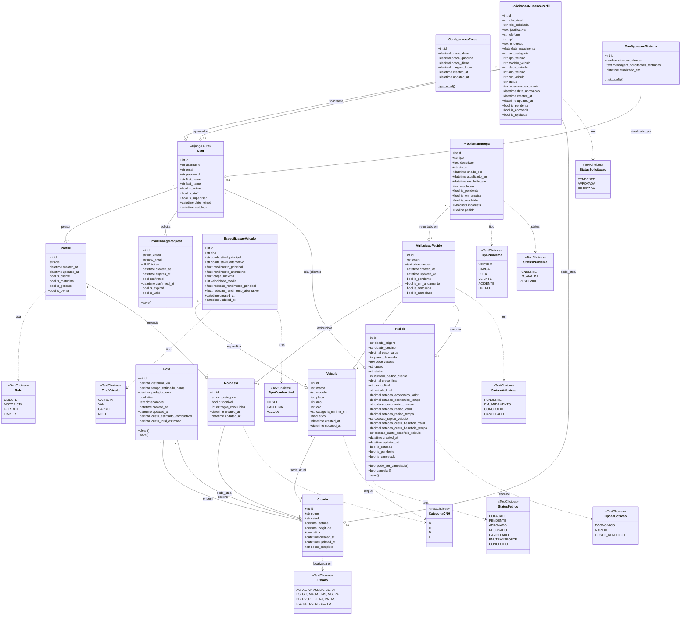

# Diagrama UML Implementado - Sistema NeoCargo

Este documento apresenta o **diagrama de classes UML real** do sistema NeoCargo, extraído diretamente do código-fonte implementado.

---

## Sobre a Implementação

O diagrama abaixo reflete a **estrutura real das classes** implementadas no sistema, baseado nos models Django do projeto. Este é o modelo **efetivamente em produção**.

### Características da Implementação

- **Framework**: Django 4.x com ORM
- **Padrão**: MVT (Model-View-Template)
- **Banco de Dados**: PostgreSQL 14+
- **Apps Django**: contas, pedidos, rotas, veiculos, motoristas, gestao
- **Autenticação**: Django Auth + Perfis customizados

---

## Diagrama de Classes Implementado

!!! tip "Dica de Visualização"
    Para melhor visualização do diagrama:
    
    - **Zoom**: Use `Ctrl + Scroll` (Windows/Linux) ou `Cmd + Scroll` (Mac)
    - **Tela Cheia**: Clique com o botão direito e selecione "Abrir imagem em nova aba"
    - **Mermaid Live**: Copie o código e cole em [Mermaid Live Editor](https://mermaid.live/) para visualização interativa

---

## Descrição dos Módulos

### 📦 App: Contas

Gerencia autenticação, perfis de usuário e mudanças de email.

**Classes Principais:**
- `User`: Modelo padrão do Django para autenticação
- `Profile`: Extensão do usuário com roles (cliente, motorista, gerente, owner)
- `EmailChangeRequest`: Solicitações de mudança de email com token de confirmação

### 📦 App: Pedidos

Gerencia todo o ciclo de vida dos pedidos de frete.

**Classes Principais:**
- `Pedido`: Pedido de frete com cotações integradas (econômico, rápido, custo-benefício)
- Suporta múltiplos status: cotação, pendente, aprovado, em transporte, concluído

### 📦 App: Rotas

Gerencia cidades, rotas e configurações de preço.

**Classes Principais:**
- `Cidade`: Cidades atendidas pela transportadora
- `Rota`: Rotas entre cidades com distância, tempo e pedágio
- `ConfiguracaoPreco`: Preços de combustível e margem de lucro

### 📦 App: Veículos

Gerencia especificações técnicas e frota de veículos.

**Classes Principais:**
- `EspecificacaoVeiculo`: Especificações técnicas por tipo (carreta, van, carro, moto)
- `Veiculo`: Instâncias reais dos veículos da frota

### 📦 App: Motoristas

Gerencia motoristas, atribuições de entregas e problemas.

**Classes Principais:**
- `Motorista`: Dados dos motoristas (CNH, disponibilidade, entregas)
- `AtribuicaoPedido`: Atribuição de pedido a motorista e veículo
- `ProblemaEntrega`: Problemas reportados durante entregas

### 📦 App: Gestão

Gerencia solicitações de mudança de perfil e configurações do sistema.

**Classes Principais:**
- `SolicitacaoMudancaPerfil`: Solicitações de mudança de role (ex: cliente → motorista)
- `ConfiguracaoSistema`: Configurações globais (singleton)

---

## Padrões de Design Utilizados

### 1. **Strategy Pattern**
- Usado nas cotações de pedidos (econômico, rápido, custo-benefício)
- Cada estratégia calcula preço e tempo de forma diferente

### 2. **State Pattern**
- Gerenciamento de status de pedidos e atribuições
- Transições de estado controladas e validadas

### 3. **Singleton Pattern**
- `ConfiguracaoSistema` e `ConfiguracaoPreco` são singletons
- Apenas uma instância ativa por vez

### 4. **Observer Pattern**
- Sistema de notificações (implícito via signals do Django)
- Mudanças de status geram notificações automáticas

### 5. **Factory Pattern**
- Criação de pedidos com cotações automáticas
- Geração de número sequencial por cliente

---

## Estatísticas do Código

| Métrica | Valor |
|---------|-------|
| **Total de Models** | 17 classes |
| **Total de Enums** | 11 enumerações |
| **Apps Django** | 6 apps |
| **Relacionamentos** | 23 foreign keys |
| **Properties** | 35+ propriedades calculadas |
| **Métodos Customizados** | 20+ métodos |

---

## Comparação: Planejado vs Implementado

| Aspecto | Planejado | Implementado |
|---------|-----------|--------------|
| **Fonte** | Backlog e requisitos | Código real (models.py) |
| **Status** | Visão futura completa | Estado atual |
| **Detalhamento** | Conceitual | Código executável |
| **Validações** | Regras de negócio | Validators do Django |
| **Relacionamentos** | Todos previstos | Apenas criados |

---

## Próximos Passos

### Funcionalidades Planejadas (Não Implementadas)

1. **Sistema de Notificações**
   - Model `Notificacao` para alertas em tempo real
   - Integração com WebSockets

2. **Histórico de Pedidos**
   - Model `PedidoHistorico` para auditoria completa
   - Rastreamento de todas as mudanças

3. **Avaliações e Feedback**
   - Model `Avaliacao` para clientes avaliarem entregas
   - Sistema de rating para motoristas

4. **Dashboard e Analytics**
   - Models para métricas e KPIs
   - Relatórios gerenciais

---

## Referências

- **Código Fonte**: `/NeoCargo/backend/apps/*/models.py`
- **Migrations**: `/NeoCargo/backend/apps/*/migrations/`
- **Testes**: `/NeoCargo/backend/apps/*/tests/test_models.py`
- **Documentação Django**: [Django Models](https://docs.djangoproject.com/en/4.2/topics/db/models/)
