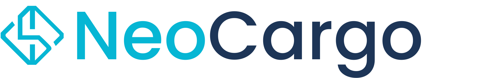

  

    

      
    

    

      <h1 class="hero-modern-title">
        NeoCargo
        Documentação Técnica
      </h1>
      

        Plataforma inteligente de simulação e alocação de veículos para transporte de cargas
      

      

        Django
        Docker
        PostgreSQL
      

    

  

---

## 🎯 Objetivo do Sistema

  

    <h3>🎯 Meta Principal</h3>
    
Construir um sistema de simulação e alocação de veículos para fretes que:

  

  

    📊
    

      <strong>Entrada de Dados</strong>
      
Receba peso, distância e prazo de entrega

    

  

  

    💰
    

      <strong>Cálculo Inteligente</strong>
      
Calcule tempo e custo por tipo de veículo (com margem de lucro e preço de combustível)

    

  

  

    🏆
    

      <strong>Três Recomendações</strong>
      
Exiba opções: menor custo, mais rápido e melhor custo-benefício

    

  

  

    🔒
    

      <strong>Controle de Disponibilidade</strong>
      
Bloqueie o veículo selecionado até a liberação

    

  

  

    💾
    

      <strong>Persistência de Dados</strong>
      
Persista frota, preços e margem de lucro

    

  

---

## ⚙️ Tecnologias

  

    
🐍

    <h3>Backend</h3>
    
Django (arquitetura MVT)

  

  
  

    
🎨

    <h3>Frontend</h3>
    
Templates do Django com HTML, CSS e JavaScript (padrão do Django)

  

  
  

    
🐳

    <h3>Infra</h3>
    
Docker (containerização)

  

  
  

    
📖

    <h3>Docs</h3>
    
MkDocs

  

---

## 📚 Navegação da Documentação

  <a href="04-brainstorm-historias/" class="nav-card-link">
    

      
01

      <h3>Brainstorm de Histórias</h3>
      
Ideação e desenvolvimento das funcionalidades do sistema

    

  </a>

  <a href="05-backlog/" class="nav-card-link">
    

      
02

      <h3>Backlog</h3>
      
Priorização e organização das demandas do projeto

    

  </a>

  <a href="06-uml-geral/" class="nav-card-link">
    

      
03

      <h3>UML Geral</h3>
      
Diagrama de classes completo do sistema NeoCargo

    

  </a>

  <a href="07-banco-dados/" class="nav-card-link">
    

      
04

      <h3>Banco de Dados</h3>
      
Modelagem relacional e estrutura do PostgreSQL

    

  </a>

